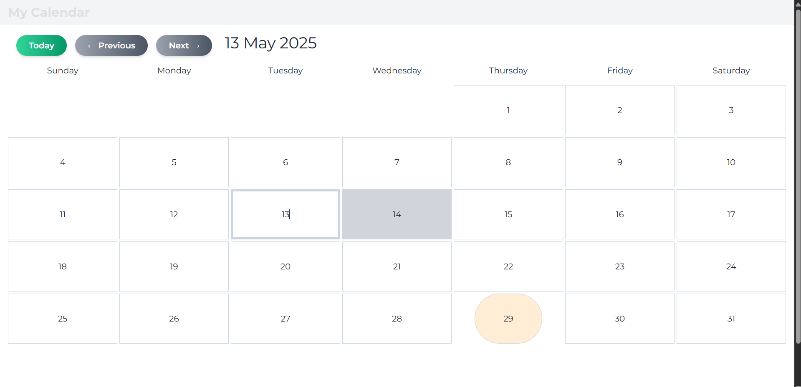

# Vue Calendar Component

A simple, customizable **Calendar** component built with Vue 3, TypeScript, and Day.js.  
Supports month navigation, day selection, and highlights today's date.

---

## Features

- Display calendar by month view
- Navigate between months with previous/next buttons
- Reset to current month with **Today** button
- Select a specific day with visual highlight
- Highlight today’s date
- Responsive grid layout with semantic HTML and accessibility (ARIA) attributes
- Smooth fade transitions for day and month changes
- Easy to customize with Tailwind CSS classes and props

---

## Demo

<!-- Replace with your actual demo gif or screenshot -->


---

## Installation

Install dependencies:

```bash
npm install
# or
yarn install
